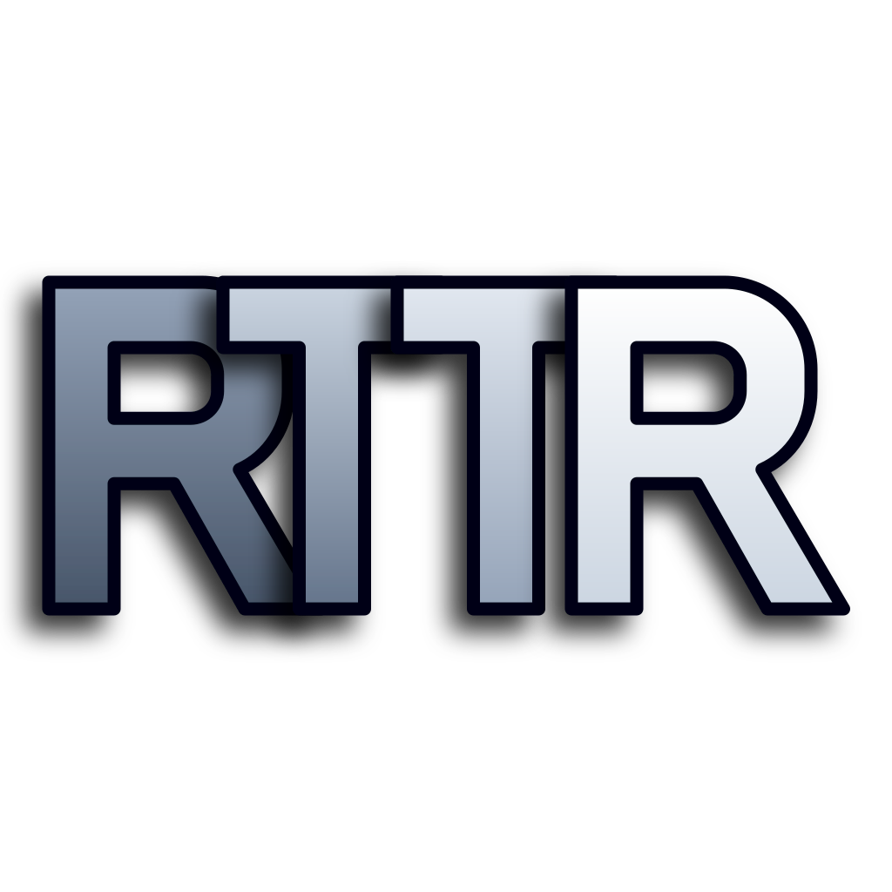

<div align="center">
  
  <h1>RTTR (Read Text To Ruby)</h1>
  <p><strong>Immersive AI Translation & Pronunciation Extension</strong></p>
  <p>
    <a href="https://github.com/Ousinki/rttr-extension/blob/main/LICENSE">
      
    </a>
    
    
  </p>
</div>

**RTTR** is a next-generation browser extension designed for an immersive, interruption-free English reading and learning experience. It combines traditional machine translation with powerful AI context analysis, empowering you to read faster and understand vocabulary deeply without ever leaving your reading flow.

*Native UI support for English, Simplified Chinese (简体中文), Traditional Chinese (繁體中文), and Japanese (日本語).*

---

## ✨ Features

- **📖 Seamless Ruby Translation:** Instead of breaking your flow with clunky popups, RTTR injects translations directly above unfamiliar words—just like phonetic ruby text (注音/ふりがな).
- **🧠 Contextual Collocation Analysis:** Long-press any word or phrase to summon the AI. RTTR analyzes the specific sentence context, providing the most accurate meaning and explaining its grammatical usage.
- **⚡ Multi-Engine Translation:** Select text to instantly translate using your choice of Google, DeepL, or Bing. Features a clean, non-intrusive UI that elegantly adapts to your cursor position.
- **🔊 Interactive Pronunciation (TTS):**
  - **Auto / Click / Shortcut:** Instantly hear standard native pronunciation (defaults to Google US English).
  - **IPA Tooltip:** Single-click a word to instantly view its IPA phonetic transcription while hearing it spoken.
- **🔐 Bring Your Own Key (BYOK):** Full privacy and control. Configure your own OpenAI-compatible API key for all AI translation features.

## 🚀 Installation & Build

RTTR is built with [WXT](https://wxt.dev/) and Vue 3.

### 1. Build from Source

1. Clone this repository:
   ```bash
   git clone https://github.com/Ousinki/rttr-extension.git
   cd rttr-extension
   ```
2. Install dependencies:
   ```bash
   npm install
   ```
3. Build the extension:
   ```bash
   npm run build
   ```
4. The compiled extension will be available in the `.output/chrome-mv3` directory.

### 2. Load into Chrome

1. Open Chrome and navigate to `chrome://extensions/`.
2. Enable **Developer mode** in the top right corner.
3. Click **Load unpacked** and select the `.output/chrome-mv3` directory.

## ⚙️ Configuration

Click the RTTR extension icon to open the **Options Page**. From there, you can:
- Enter your OpenAI-compatible API Key, Endpoint, and Model.
- Select your preferred machine translation engine (Google/DeepL/Bing).
- Configure TTS (Text-to-Speech) voices, volume, and rate.
- Toggle specific translation triggers (Click, Selection, Long-press, etc.).

## 🤝 Acknowledgements

Special thanks to the [MouseTooltipTranslator](https://github.com/ttop32/MouseTooltipTranslator) project. The core logic for our multi-engine API translation requests (Google, DeepL, Bing) was deeply inspired by and adapted from their excellent work.

## 📜 License

This project is licensed under the [MIT License](LICENSE).
